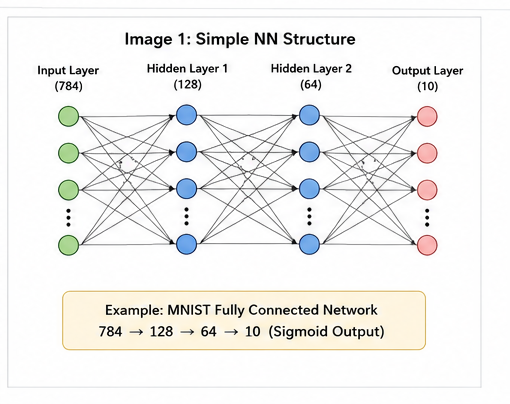
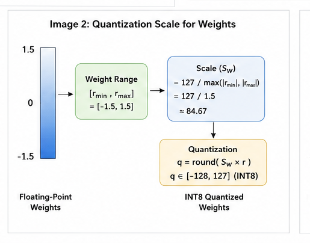
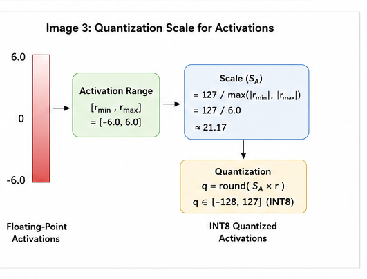

# DNN-accelerator

# Mathematical Formulation and Matrix Tiling

A Fully Connected (FC) layer in a neural network can be represented as a matrix multiplication followed by bias addition and an activation function. This representation allows the computation of a DNN layer to be mapped onto the matrix-multiplication hardware of the accelerator.

## 1. Fully Connected Neural Network

A Fully Connected Neural Network (FNN) consists of layers of neurons where every neuron in one layer is connected to every neuron in the next layer. Each connection has an associated **weight**, while each output neuron has an associated **bias**.



For clear mathematical implementation of Neural Network watch this video [Link](link).

For example, the connection between input neuron $x_i$ and output neuron $y_j$ has a corresponding weight $w_{ij}$.

Therefore, the output of neuron $j$ before applying the activation function is:

$$y_j = x_0w_{0j} + x_1w_{1j} + \cdots + x_{N-1}w_{N-1,j} + b_j$$

This can be written more compactly as:

$$y_j = \sum_{i=0}^{N-1} x_iw_{ij}+b_j$$

where:

- $x_i$ represents the $i$-th input activation.
- $w_{ij}$ represents the weight connecting input neuron $i$ to output neuron $j$.
- $b_j$ represents the bias associated with output neuron $j$.
- $y_j$ represents the output of neuron $j$ before activation.

Thus, the computation performed by each neuron is essentially a **dot product followed by bias addition**.

---

## 2. Fully Connected Layer as Matrix Multiplication

Consider a fully connected layer with $N$ input neurons and $M$ output neurons.

The input activations can be represented as a vector:

$$X = \begin{bmatrix} x_0 & x_1 & \cdots & x_{N-1} \end{bmatrix}$$

The weights connecting the input neurons to the output neurons can be represented as a matrix:

$$W = \begin{bmatrix} w_{00} & w_{01} & \cdots & w_{0,M-1} \\ w_{10} & w_{11} & \cdots & w_{1,M-1} \\ \vdots & \vdots & \ddots & \vdots \\ w_{N-1,0} & w_{N-1,1} & \cdots & w_{N-1,M-1} \end{bmatrix}$$

where:

$$W \in \mathbb{R}^{N \times M}$$

Each column of $W$ contains all the weights connected to one output neuron.

The biases can be represented as a vector:

$$B = \begin{bmatrix} b_0 & b_1 & \cdots & b_{M-1} \end{bmatrix}$$

The output of the fully connected layer before applying the activation function is:

$$Y = XW + B$$

where:

$$X \in \mathbb{R}^{1 \times N}, \qquad W \in \mathbb{R}^{N \times M}, \qquad Y \in \mathbb{R}^{1 \times M}$$

Therefore:

$$(1 \times N)(N \times M) = (1 \times M)$$

For an individual output neuron $j$:

$$y_j = \sum_{i=0}^{N-1} x_iw_{ij}+b_j$$

After the matrix operation, an activation function $f$ is applied element-wise:

$$A = f(Y)$$

Hence, the complete computation of a fully connected layer can be expressed as:

$$A = f(XW+B)$$

This transformation converts the computation of individual neurons into a matrix operation, which is more suitable for hardware acceleration.

---

## 3. Representing Multiple Inputs as a Matrix

When multiple input samples are processed together, the input vectors can be arranged as rows of a matrix.

For a batch containing $K$ input samples:

$$X = \begin{bmatrix} x_{0,0} & x_{0,1} & \cdots & x_{0,N-1} \\ x_{1,0} & x_{1,1} & \cdots & x_{1,N-1} \\ \vdots & \vdots & \ddots & \vdots \\ x_{K-1,0} & x_{K-1,1} & \cdots & x_{K-1,N-1} \end{bmatrix}$$

where:

$$X \in \mathbb{R}^{K \times N}$$

The fully connected layer then becomes:

$$Y = XW + B$$

with:

$$X_{K \times N} \times W_{N \times M} = Y_{K \times M}$$

Therefore:

$$(K \times N)(N \times M) = K \times M$$

This representation allows the computation of multiple input samples to be expressed as a matrix-matrix multiplication.

---

## 4. Matrix Tiling

The accelerator operates on fixed-size matrix blocks of **16 × 16**. Therefore, larger matrices are divided into smaller 16 × 16 sub-matrices before being mapped to the accelerator.

For a matrix with dimensions $H \times W$, the number of required row and column blocks is:

$$R = \left\lceil \frac{H}{16} \right\rceil, \qquad C = \left\lceil \frac{W}{16} \right\rceil$$

If the original matrix dimensions are not multiples of 16, the matrix is zero-padded to the next multiple of 16.

For example, a matrix of size $20 \times 30$ is padded to $32 \times 32$.

The padded matrix can then be represented as a matrix of 16 × 16 sub-matrices:

$$A = \begin{bmatrix} A_{00} & A_{01} \\ A_{10} & A_{11} \end{bmatrix}$$

where each sub-matrix has dimensions:

$$A_{ij} \in \mathbb{R}^{16 \times 16}$$

The matrix is therefore represented as a **matrix of sub-matrices**, rather than as a single large matrix.

Zero-padding allows the accelerator to maintain a fixed 16 × 16 computation size even when the original matrix dimensions are not multiples of 16.

---

## 5. Matrix Multiplication Using Sub-Matrices

Consider two matrices partitioned into 16 × 16 sub-matrices:

$$A = \begin{bmatrix} A_{00} & A_{01} \\ A_{10} & A_{11} \end{bmatrix} \qquad B = \begin{bmatrix} B_{00} & B_{01} \\ B_{10} & B_{11} \end{bmatrix}$$

The matrix multiplication is:

$$C = AB$$

where the resulting matrix is:

$$C = \begin{bmatrix} C_{00} & C_{01} \\ C_{10} & C_{11} \end{bmatrix}$$

The output sub-matrices are calculated as:

$$C_{00}=A_{00}B_{00}+A_{01}B_{10}$$

$$C_{01}=A_{00}B_{01}+A_{01}B_{11}$$

$$C_{10}=A_{10}B_{00}+A_{11}B_{10}$$

$$C_{11}=A_{10}B_{01}+A_{11}B_{11}$$

In general, the computation of an output sub-matrix is:

$$C_{ij} = \sum_k A_{ik}B_{kj}$$

Each multiplication $A_{ik}B_{kj}$ is therefore a **16 × 16 matrix multiplication**, and the resulting matrices are accumulated to produce the corresponding output sub-matrix.

---

## 6. Mapping the Mathematics to the Accelerator

The mathematical formulation above describes the complete matrix multiplication of a fully connected layer. The accelerator maps this computation onto a fixed-size matrix operation.

The basic matrix operation supported by the accelerator is:

$$(1 \times 16) \times (16 \times 16) = (1 \times 16)$$

The input activation vector is divided into groups of 16 elements.

For example:

$$X = \begin{bmatrix} x_0 & x_1 & \cdots & x_{15} & x_{16} & \cdots & x_{N-1} \end{bmatrix}$$

Each group of 16 input values forms a $1 \times 16$ input matrix:

$$X_0 = \begin{bmatrix} x_0 & x_1 & \cdots & x_{15} \end{bmatrix}$$

The corresponding weights are stored as a $16 \times 16$ matrix:

$$W_0 = \begin{bmatrix} w_{00} & w_{01} & \cdots & w_{0,15} \\ w_{10} & w_{11} & \cdots & w_{11,15} \\ \vdots & \vdots & \ddots & \vdots \\ w_{15,0} & w_{15,1} & \cdots & w_{15,15} \end{bmatrix}$$

The accelerator then computes:

$$Y_0 = X_0W_0$$

where:

$$Y_0 \in \mathbb{R}^{1 \times 16}$$

This produces 16 partial output values corresponding to a group of 16 output neurons.

For an input vector containing more than 16 elements, additional $1 \times 16$ input blocks are processed with their corresponding $16 \times 16$ weight blocks.

For example:

$$X = \begin{bmatrix} X_0 & X_1 \end{bmatrix}$$

where $X_0 \in \mathbb{R}^{1 \times 16}$ and $X_1 \in \mathbb{R}^{1 \times 16}$.

The corresponding weight matrix can be partitioned as:

$$W = \begin{bmatrix} W_0 \\ W_1 \end{bmatrix}$$

where $W_0 \in \mathbb{R}^{16 \times 16}$ and $W_1 \in \mathbb{R}^{16 \times 16}$.

The complete output is then obtained by accumulating the partial matrix products:

$$Y = X_0W_0 + X_1W_1$$

Therefore, a large fully connected layer is converted into a sequence of fixed-size operations:

```text
Input Vector
     │
     ▼
Split into 1 × 16 blocks
     │
     ├───────────────┐
     ▼               ▼
  X₀ (1×16)       X₁ (1×16)
     │               │
     ▼               ▼
  W₀ (16×16)      W₁ (16×16)
     │               │
     ▼               ▼
  X₀ × W₀         X₁ × W₁
     │               │
     └───────┬───────┘
             ▼
       Accumulation
             │
             ▼
       Output (1×16)
```

---

# Quantization

Neural networks are commonly trained and represented using floating-point numbers such as FP32. Although floating-point representation provides high numerical precision, it requires more memory and computational resources.

**Quantization** converts floating-point values into lower-precision integer values while attempting to preserve the numerical behavior of the original neural network.

In this project, the neural-network weights and activations are quantized to **INT8**, while the bias is quantized to **INT32**.

The basic quantization operation is:

$$q = \text{round}\left(\frac{x}{S}\right)$$

where:

- $x$ is the original floating-point value.
- $S$ is the quantization scale.
- $q$ is the resulting integer value.

For symmetric INT8 quantization, the representable range is:

$$-128 \leq q \leq 127$$

The corresponding floating-point value can approximately be reconstructed using:

$$x \approx qS$$

Therefore, the scale determines how much the original floating-point range is compressed into the available INT8 range.

---

## 7. Quantization Scale and Resolution

For symmetric quantization, the scale is determined from the maximum absolute value in the tensor:

$$S = \frac{\max(|x|)}{127}$$

The quantized value is then calculated as:

$$q = \text{round}\left(\frac{x}{S}\right)$$

For example, if the values lie approximately within $[-1,1]$ then:

$$S = \frac{1}{127}$$

The available INT8 values are therefore mapped across the range $[-1,1]$ with a relatively small step size.

The distance between two consecutive representable floating-point values is approximately equal to the scale:

$$\Delta x \approx S$$

Therefore:

- **Smaller scale → finer resolution → smaller quantization error**
- **Larger scale → coarser resolution → potentially larger quantization error**

### Quantization Resolution

Consider two different floating-point ranges being mapped to the same INT8 range.



When the original values occupy a smaller numerical range, the 256 available INT8 levels are concentrated over a smaller range. Therefore, the distance between adjacent representable floating-point values is smaller.

For example, with $S = 0.01$, the quantization levels are approximately:

$$\ldots,-0.02,-0.01,0,0.01,0.02,\ldots$$

On the other hand, when the original values occupy a larger range:



the same 256 INT8 levels must cover a larger numerical range.

For example, with $S = 0.1$, the quantization levels become:

$$\ldots,-0.2,-0.1,0,0.1,0.2,\ldots$$

Thus, values that are close together in the original floating-point representation may be mapped to the same integer value when the scale is large.

This illustrates the trade-off in quantization:

> **Larger represented range → larger scale → lower resolution**

---

## 8. Weight Quantization

The trained floating-point weights are converted to INT8 before being stored in the accelerator memory.

For a weight matrix $W$, the weight scale is calculated as:

$$S_W = \frac{\max(|W|)}{127}$$

Each weight is then quantized using:

$$W_q = \text{round}\left(\frac{W}{S_W}\right)$$

where:

$$-128 \leq W_q \leq 127$$

The approximate floating-point weight can be recovered using:

$$W \approx W_qS_W$$

The use of INT8 weights significantly reduces the amount of memory required to store the neural-network parameters compared with FP32 representation.

For example, FP32 uses 32 bits/value while INT8 uses 8 bits/value. Therefore, an INT8 representation requires approximately one-fourth of the storage required by FP32.

---

## 9. Activation Quantization

Unlike weights, activation values depend on the input data and can have different numerical ranges at different layers.

Therefore, the activation ranges are determined during **Post-Training Quantization (PTQ)**.

Representative input samples are passed through the floating-point model, and the minimum and maximum values of the layer activations are collected.

The scale for an activation tensor is then calculated from its maximum absolute value:

$$S_X = \frac{\max(|X|)}{127}$$

The activation is quantized using:

$$X_q = \text{round}\left(\frac{X}{S_X}\right)$$

The implementation collects separate ranges for:

- Layer input activations
- Pre-activation outputs
- Post-activation outputs

These ranges are used to determine the corresponding quantization scales during PTQ.

---

## 10. Quantization Before and After Activation

A fully connected layer performs:

$$Y = XW+B$$

followed by an activation function:

$$A=f(Y)$$

In the quantized accelerator, these stages use different numerical representations.

The input activations and weights are represented using INT8:

$$X_q \in \text{INT8}, \qquad W_q \in \text{INT8}$$

The multiplication is therefore $X_qW_q$. Since many INT8 multiplication results must be accumulated, a wider representation is required for the accumulator.

The bias is also represented using INT32.

The computation can therefore be represented as:

```text
INT8 Input
     │
     ▼
INT8 × INT8
     │
     ▼
INT32 Accumulation
     │
     ▼
Bias Addition
     │
     ▼
Requantization
     │
     ▼
INT8 Pre-Activation
     │
     ▼
Activation Function
     │
     ▼
INT8 Output Activation
```

The important point is that quantization is not simply converting every value to INT8 at every stage. The intermediate accumulation requires a wider representation before the result is scaled back to the required INT8 range.

---

## 11. Quantization Before the Activation Function

The output of the matrix multiplication and bias addition is the pre-activation value:

$$Y = XW+B$$

In the quantized implementation, the input activations and weights are represented using INT8:

$$X_q \in \text{INT8}, \qquad W_q \in \text{INT8}$$

The multiplication results are accumulated using a wider representation:

$$Y_{\text{acc}} = X_qW_q+B_q$$

where $Y_{\text{acc}}$ is represented using INT32.

The accumulated result must then be scaled back to the quantization range required by the next stage.

If $X \approx X_qS_X$ and $W \approx W_qS_W$, then:

$$XW \approx X_qW_qS_XS_W$$

Let $S_A$ be the scale of the output activation. The requantized result can therefore be represented as:

$$Y_q = \text{round}\left(Y_{\text{acc}} \cdot \frac{S_XS_W}{S_A}\right)$$

The resulting value is converted to INT8:

$$-128 \leq Y_q \leq 127$$

The computation before the activation function can therefore be represented as:

```text
INT8 Input
     │
     ▼
Matrix Multiplication
     │
     ▼
INT32 Accumulation
     │
     ▼
Bias Addition
     │
     ▼
Requantization
     │
     ▼
INT8 Pre-Activation
```

The resulting INT8 pre-activation value is then passed to the activation function.

---

## 12. Quantization After the Activation Function

The activation function transforms the pre-activation value:

$$A=f(Y)$$

Different activation functions produce different numerical ranges.

For example, the ReLU activation function is:

$$f(x)=\max(0,x)$$

Therefore $A\geq 0$.

For the sigmoid activation function:

$$f(x)=\frac{1}{1+e^{-x}}$$

and $0<A<1$.

Since the output range of the activation function can be different from the pre-activation range, the activation output can require a separate quantization scale.

The activation output is quantized using:

$$A_q = \text{round}\left(\frac{A}{S_A}\right)$$

where $S_A$ is the scale corresponding to the activation output.

The resulting INT8 activation becomes the input to the next layer.

The complete flow is:

```text
INT8 Pre-Activation
        │
        ▼
   Activation
        │
        ▼
Activation Output
        │
        ▼
  Quantization
        │
        ▼
INT8 Activation
        │
        ▼
   Next Layer
```

Therefore, the quantization scale can change between the pre-activation and post-activation stages depending on the numerical range of the data.

---

## 13. Activation Function Using a Lookup Table

Nonlinear activation functions such as sigmoid require additional computation if implemented directly using arithmetic hardware.

To reduce this computational complexity, the accelerator uses a 256-entry Lookup Table (LUT).

For an INT8 input $-128 \leq x_q \leq 127$, the input can be mapped to a LUT index using:

$$\text{index} = x_q + 128$$

This produces an index in the range $0 \leq \text{index} \leq 255$.

Therefore, the complete INT8 input range can be represented using a 256-entry LUT.

The activation process becomes:

```text
INT8 Pre-Activation
        │
        ▼
    LUT Index
        │
        ▼
  Activation LUT
        │
        ▼
 INT8 Activation
```

For example, for the ReLU activation $f(x)=\max(0,x)$, the LUT can store the corresponding quantized output values.

For the sigmoid activation $f(x)=\dfrac{1}{1+e^{-x}}$, the LUT contains precomputed sigmoid values corresponding to the possible quantized input values.

Instead of calculating the sigmoid function during inference, the accelerator performs a lookup:

$$x_q \rightarrow \text{LUT Index} \rightarrow f(x_q)$$

This replaces the direct computation of the nonlinear function with a simple memory lookup operation.

---

## 14. Complete Quantized FNN Inference

Combining the matrix operation, quantization, requantization, and activation stages, a single quantized FNN layer can be represented as:

$$X_qW_q \rightarrow \text{INT32 Accumulation} \rightarrow \text{Bias Addition} \rightarrow \text{Requantization} \rightarrow \text{INT8 Pre-Activation} \rightarrow \text{Activation} \rightarrow A_q$$

The complete layer can therefore be represented as:

```text
                 INT8 Input
                     │
                     ▼
          +---------------------+
          |   Matrix Operation  |
          | (1x16) x (16x16)    |
          +----------+----------+
                     │
                     ▼
             INT32 Accumulation
                     │
                     ▼
                Bias Addition
                     │
                     ▼
               Requantization
                     │
                     ▼
             INT8 Pre-Activation
                     │
                     ▼
              Activation LUT
                     │
                     ▼
              INT8 Activation
                     │
                     ▼
               Next FNN Layer
```

The output activation of one layer becomes the input activation of the next layer:

$$A_q^{(l)} \rightarrow X_q^{(l+1)}$$

The same process is then repeated for every layer of the neural network.

---

## 15. Complete Quantized FNN Inference Flow

The complete inference process can be summarized as:

```text
                    Input
                      │
                      ▼
              +---------------+
              |   FNN Layer   |
              +-------+-------+
                      │
                      ▼
              INT8 Matrix
              Multiplication
                      │
                      ▼
             INT32 Accumulation
                      │
                      ▼
                Bias Addition
                      │
                      ▼
               Requantization
                      │
                      ▼
             INT8 Pre-Activation
                      │
                      ▼
              Activation LUT
                      │
                      ▼
             INT8 Activation
                      │
                      ▼
               Next FNN Layer
                      │
                      ▼
                    Repeat
                      │
                      ▼
               Final Output
```

For each layer, the accelerator performs the fixed-size matrix operation:

$$(1\times16)\times(16\times16)=(1\times16)$$

The resulting partial outputs are accumulated across the required input blocks and output blocks.

The output activation of one layer is then used as the input to the next layer:

$$A_q^{(l)} \rightarrow X_q^{(l+1)}$$

Therefore, by repeating the same sequence of matrix multiplication, accumulation, bias addition, requantization, and activation for every layer, the accelerator can perform a complete quantized FNN inference.

---

## 16. Post-Training Quantization (PTQ) Calibration

Before a floating-point model can run on the accelerator, the quantization scale of every layer input, pre-activation output, and post-activation output must be determined. This project computes these scales using a **calibration pass**: a set of representative inputs is run through the floating-point model, and the minimum and maximum values observed at each stage are recorded.

For every layer $j$, three separate ranges are tracked while the calibration inputs are processed:

- The range of the **layer input activations**, $X^{(j)}$
- The range of the **pre-activation output** (after the matrix multiply and bias add), $Y^{(j)}$
- The range of the **post-activation output** (after the activation function), $A^{(j)}$

For each calibration sample $x_i$, the floating-point forward pass is executed and the observed minimum and maximum of each tensor is appended to a running list:

$$\text{max\_layer}[j] = \max_i \big(\max(X_i^{(j)})\big), \qquad \text{min\_layer}[j] = \min_i \big(\min(X_i^{(j)})\big)$$

$$\text{max\_bact}[j] = \max_i \big(\max(Y_i^{(j)})\big), \qquad \text{min\_bact}[j] = \min_i \big(\min(Y_i^{(j)})\big)$$

$$\text{max\_aact}[j] = \max_i \big(\max(A_i^{(j)})\big), \qquad \text{min\_aact}[j] = \min_i \big(\min(A_i^{(j)})\big)$$

Once calibration is complete, each tensor's symmetric scale is derived from the largest absolute value observed across the calibration set:

$$S = \frac{\max\big(|\text{max}|,\ |\text{min}|\big)}{127}$$

This produces three scales per layer:

- $S_X^{(j)}$ — input activation scale (`layer_scale`)
- $S_{Y}^{(j)}$ — pre-activation (bias-added) output scale (`bact_scale`)
- $S_{A}^{(j)}$ — post-activation output scale (`aact_scale`)

Because the calibration pass uses the **unquantized** floating-point model, it produces the true dynamic range of every layer before any rounding error is introduced, which is what makes this a *post-training* quantization scheme — the floating-point model does not need to be retrained or made aware of quantization in advance.

---

## 17. Weight and Bias Quantization Implementation

Once the per-layer scales are known, the floating-point weights and biases stored in the model are converted to fixed-point integers.

**Weight quantization** follows the symmetric INT8 scheme described in Section 8, using the maximum absolute weight value of each layer as the scale:

$$S_W^{(j)} = \frac{\max\big(|W^{(j)}|\big)}{127}, \qquad W_q^{(j)} = \text{round}\left(\frac{W^{(j)}}{S_W^{(j)}}\right)$$

The quantized values are then clipped to the representable INT8 range:

$$-128 \le W_q^{(j)} \le 127$$

**Bias quantization** cannot use an independently computed scale. Because the bias is added directly to the INT32 accumulator produced by $X_qW_q$, its scale must match the *combined* scale of the input and weight quantization so that the addition is numerically consistent:

$$S_B^{(j)} = S_X^{(j)} \cdot S_W^{(j)}$$

$$B_q^{(j)} = \text{round}\left(\frac{B^{(j)}}{S_B^{(j)}}\right)$$

The result is stored as INT32, since the accumulated products $X_qW_q$ require a wider range than INT8 before requantization.

---

## 18. The Requantization Scale

After the INT32 accumulation and bias addition produce $Y_{\text{acc}}$, the result must be rescaled from the "input × weight" domain back into the INT8 domain expected by the next stage. Combining Sections 10 and 11, the requantization factor applied to every element of $Y_{\text{acc}}$ is:

$$\text{scale} = \frac{S_X \cdot S_W}{S_{Y}}$$

where $S_{Y}$ is the calibrated pre-activation scale for that layer (`sbo` in the implementation, short for *scale-bias-output*). This single scalar factor is precomputed once per layer during calibration and reused for every inference, rather than being recomputed per sample. Applying it and truncating to INT8 gives the pre-activation value:

$$Y_q = \left\lfloor Y_{\text{acc}} \cdot \text{scale} \right\rfloor, \qquad -128 \le Y_q \le 127$$

Note that the accelerator implementation uses a **floor** rather than a **round** when truncating to INT8, since the rescaling is performed directly in hardware-friendly fixed-point arithmetic.

---

## 19. Quantized Forward Pass

With all scales and quantized parameters computed, inference proceeds one layer at a time through the following stages, matching the pipeline in Section 14:

1. **Matrix multiplication** — the INT8 input block is multiplied with the INT8 weight block using the tiled $16 \times 16$ sub-matrix scheme from Section 5.
2. **INT32 accumulation** — partial products from every $16 \times 16$ tile along the reduction dimension are summed in a wider accumulator to avoid overflow.
3. **Bias addition** — the INT32 bias for that output block is added to the accumulated result.
4. **Requantization** — the accumulated sum is multiplied by the layer's precomputed `scale_` factor (Section 18) and floored to INT8.
5. **Activation lookup** — the INT8 pre-activation value is passed through the layer's activation LUT (Section 21) to produce the INT8 activation output.

The output of this pipeline for layer $j$ becomes the input to layer $j+1$, exactly as described in Section 14:

$$A_q^{(j)} \rightarrow X_q^{(j+1)}$$

This repeats for every layer until the final output layer is reached, at which point the last activation output is returned as the network's quantized prediction.

---

## 20. Splitting the INT32 Bias for Storage

The accelerator's memory is organized in byte-addressable blocks, so a 32-bit bias value cannot be written to memory as a single unit — it must be split into four INT8 byte planes before being stored. Given an INT32 bias value $b$, the four bytes are extracted as:

$$b_0 = b \,\&\, \text{0xFF}, \qquad b_1 = (b \gg 8) \,\&\, \text{0xFF}$$

$$b_2 = (b \gg 16) \,\&\, \text{0xFF}, \qquad b_3 = (b \gg 24) \,\&\, \text{0xFF}$$

Each byte plane $b_0, b_1, b_2, b_3$ is stored in memory as its own $16 \times 16$-tiled matrix. During the bias-addition stage of the matrix engine, each byte plane is added back in with the appropriate bit shift, reconstructing the full INT32 bias contribution:

$$b = b_0 + (b_1 \ll 8) + (b_2 \ll 16) + (b_3 \ll 24)$$

This byte-plane layout allows the same $16 \times 16$ INT8 memory and datapath used for weights and activations to also carry the wider INT32 bias values, without requiring a separate 32-bit-wide memory bank.

---

## 21. Building the Activation Lookup Table

As introduced in Section 13, nonlinear activation functions are implemented using a 256-entry LUT rather than direct computation. The LUT is generated once per layer, immediately after that layer's requantization scale is known, and depends on which activation function the layer uses.

**ReLU LUT.** Since ReLU is piecewise linear, the LUT is populated directly from the quantized index:

$$\text{LUT}[i + 128] = \text{clip}(i,\ 0,\ 127), \qquad -128 \le i \le 127$$

**Sigmoid LUT.** Because sigmoid is nonlinear, each table entry must be computed by de-quantizing the index back to a floating-point value, evaluating the sigmoid function, and re-quantizing the result using the *output* activation scale $S_A$:

$$x = i \cdot S_{Y}, \qquad y = \frac{1}{1+e^{-x}}, \qquad \text{LUT}[i+128] = \text{clip}\left(\text{round}(y / S_A),\ 0,\ 127\right)$$

Here $S_{Y}$ is the layer's pre-activation scale (the LUT's input domain) and $S_A$ is the layer's post-activation scale (the LUT's output domain) — the same two scales calibrated in Section 16. Because the LUT is precomputed once per layer and stored in memory, evaluating a nonlinear activation at inference time is reduced to a single indexed memory read, avoiding any exponential or floating-point computation in hardware.

---

## 22. Summary: From Floating-Point Model to Accelerator Memory

Putting Sections 16–21 together, converting a trained floating-point model into an accelerator-ready quantized model follows this pipeline:

```text
Floating-point model (FP32 weights, biases)
             │
             ▼
   Run calibration inputs through
   the floating-point model
             │
             ▼
 Record min/max of layer inputs,
 pre-activations, and post-activations
             │
             ▼
   Derive per-layer scales
   S_X , S_W , S_Y (bact) , S_A (aact)
             │
             ▼
  Quantize weights → INT8  (using S_W)
  Quantize biases  → INT32 (using S_X · S_W)
             │
             ▼
   Precompute requantization scale
        (S_X · S_W) / S_Y
             │
             ▼
   Build activation LUT (using S_Y , S_A)
             │
             ▼
  Split biases into 4 INT8 byte planes
             │
             ▼
   Write weights, bias planes, scale,
   and LUT into the tiled memory bank
             │
             ▼
   Quantized model ready for
   accelerator inference
```

Each quantized layer is now fully self-contained: its INT8 weight tiles, its four INT8 bias byte-planes, its single requantization scale, and its 256-entry activation LUT are all that the accelerator needs to execute that layer's contribution to the fully connected network described in Sections 1–6.

---

# Software Implementation

The notebook implements a small software model of the accelerator's data path. Every mathematical concept described above (matrix tiling, quantization, requantization, LUT-based activation) is implemented as a Python class so that the same model can run a **floating-point forward pass** for training/reference, and a **quantized forward pass** that also emits the accelerator's memory layout and instruction stream. The classes are described below by *what they do*, not by their internal instruction encoding.

## 23. Class Overview

### `Mem_bank`
Represents the accelerator's flat memory. It doesn't know about neural networks — it only knows how to serialize numeric data into the fixed-width binary rows the hardware expects, and hand back the starting address of whatever it just stored. It provides three kinds of allocation:
- Sub-matrix tiles (weights, activations, bias byte-planes)
- A single scale value (per-layer requantization factor)
- A 256-entry activation LUT

Every allocation returns the base address at which that data now lives, and the bank keeps a running address counter so nothing overlaps. At the end of a run, `store_mem()` dumps the whole memory image to `memory1.mem`.

### `Matrix`
The central data structure of the software model. It wraps a NumPy array and transparently handles the **zero-padding and 16×16 tiling** described in Section 4 — any matrix (or vector) passed in is automatically padded and split into a grid of `sub_mat` tiles, and can also be reconstructed in the other direction (`is_sub_mat=True`) from a grid of tiles back into a full matrix.

Besides holding data, `Matrix` carries a memory `address` once it's been allocated in a `Mem_bank`, which lets other objects (like `Layer_interconnect`) refer to "where this data lives" rather than passing the data itself.

### `Layers`
A lightweight container for one layer of the network: how many neurons it has, which activation function it uses (`Relu`, `sigmoid2`, or none for the input layer), and its current activation values as a `Matrix`. It has no computation logic itself — it is just the network's neuron state at a point in time.

### `Layer_interconnect`
Represents the **connection between two consecutive layers** — i.e. one fully connected layer's weights, bias, and (optionally) quantization scales. This is where most of the actual "layer" computation logic lives:
- Builds the layer's activation LUT once, based on the layer's activation function and its calibrated scales (Section 21).
- Runs the floating-point forward pass (`forward_pass`) for reference/training-mode inference.
- Runs the quantized forward pass (`quantize_forward_pass`), which performs the INT8×INT8 tiled matmul, INT32 accumulation, bias addition, and requantization to INT8 described in Sections 17–19.
- Allocates its own weights, split bias byte-planes, scale, and LUT into a `Mem_bank` (`initiate_addr`), implementing Sections 17 and 20.
- Applies the activation function, either as true floating-point math (`Activation_func`) or as a LUT lookup on quantized data (`qActivation_func`).

### `NN`
The top-level network object that owns a list of `Layers` and the `Layer_interconnect` between each consecutive pair, plus a single shared `Mem_bank`. It offers two parallel execution paths:
- `forward` — a plain floating-point inference pass through every layer, used for calibration and for generating a floating-point reference output to compare against.
- `quantize_forward` — a full quantized inference pass through every layer, which also emits accelerator instructions and writes both the instruction stream (`instr_mem.mem`) and the memory image (`memory1.mem`) to disk.

It also implements the **PTQ calibration and model-quantization pipeline** (Section 16 and 22) in `new_PTQ_model_gen`: it runs a batch of calibration inputs through the floating-point network, collects per-layer min/max statistics for inputs, pre-activations, and post-activations, derives the corresponding scales, quantizes every layer's weights and biases, and returns a brand-new `NN` instance built entirely from quantized parameters — ready to run `quantize_forward`.

---

## 24. Important Functions Explained

### `Matrix.sub_mat_mul(...)`
The core compute routine of the software model. It performs the tiled matrix multiplication described in Section 5 — looping over row-blocks, column-blocks, and the shared reduction dimension, multiplying and accumulating 16×16 tiles with NumPy — and, at the same time, generates the sequence of accelerator instructions that would perform the same computation in hardware (matrix fetches, multiply-accumulate, and optional bias addition). It returns both the instruction stream and a new `Matrix` holding the result, so simulation (getting the right numeric answer) and instruction generation (getting the right hardware program) happen from a single source of truth.

### `NN.new_PTQ_model_gen(x)`
Implements the full calibration-to-quantized-model pipeline from Sections 16–18 in one function. For every calibration sample, it runs a floating-point forward pass and records the min/max of each layer's input, pre-activation, and post-activation tensors. Once calibration finishes, it converts those ranges into symmetric per-layer scales, quantizes every layer's weights (INT8) and biases (INT32, using the combined input×weight scale), and constructs a new fully quantized `NN` ready for hardware-accurate inference.

### `NN.quantize_forward(inp)`
Runs one full quantized inference pass through the network. On its first call it allocates every layer's weights, bias byte-planes, scale, and LUT into the shared `Mem_bank` (so this only happens once, not on every inference). Then, layer by layer, it calls `Layer_interconnect.quantize_forward_pass` and `qActivation_func`, accumulates the emitted instructions, and finally writes both the memory image and instruction stream to disk. Its return value is the final layer's INT8 output — the network's quantized prediction.

### `quantize(x, scale)` / `Matrix` quantization helpers (`quantize_int8`, `quantize_int32`)
Small utility functions implementing the basic quantization formula from Section 7: divide by the scale, round, and clip to the representable INT8 (or INT32, for bias) range. These are the building blocks that `new_PTQ_model_gen` calls once the scales have been calibrated.

### `split_bias_bytes(bias)`
Implements the INT32-to-four-INT8-byte-planes split from Section 20 using bitwise masks and shifts (`& 0xFF`, `>> 8`, `>> 16`, `>> 24`), so each bias can be stored in the same INT8-tiled memory used for weights and activations.

### `Layer_interconnect.__init__` LUT construction
Builds the 256-entry activation LUT the moment a `Layer_interconnect` is created, following the two cases from Section 21: a direct clip-based table for ReLU, or a dequantize → evaluate sigmoid → requantize table for `sigmoid2`, using the layer's pre-activation and post-activation scales.

---

## 25. End-to-End Software Flow

Tying the classes and functions above together, a typical run in the notebook follows this sequence:

```text
1. Define network topology
     L0, L1, L2, L3 = Layers(...)   # Section: Layers class
     net = NN([L0, L1, L2, L3], model_weights = trained_weights)

2. Calibrate + quantize the model
     q_net = net.new_PTQ_model_gen(calibration_inputs)
         → runs floating-point forward() passes
         → collects per-layer min/max statistics
         → derives S_X, S_W, S_Y, S_A scales
         → quantizes weights (INT8) and biases (INT32)
         → returns a new, fully quantized NN

3. Run quantized inference
     out = q_net.quantize_forward(quantize(test_input, input_scale)[0])
         → first call: allocates weights/bias/scale/LUT into Mem_bank
         → tiled INT8 matmul + INT32 accumulation (per layer)
         → bias addition + requantization to INT8
         → LUT-based activation
         → writes memory1.mem and instr_mem.mem to disk

4. Compare outputs
     np.argmax(out.mat)  vs.  np.argmax(y_test[i])
         → measures quantized-model accuracy against ground truth
         → and against the original floating-point model's predictions
```

This mirrors the mathematical pipeline of Sections 1–22: the `Matrix` class implements the tiling math (Sections 1–6), `NN.new_PTQ_model_gen` implements calibration and quantization (Sections 7–9, 16–18), and `Layer_interconnect`/`NN.quantize_forward` implement the quantized inference pipeline and instruction/memory generation (Sections 10–15, 19–22).
